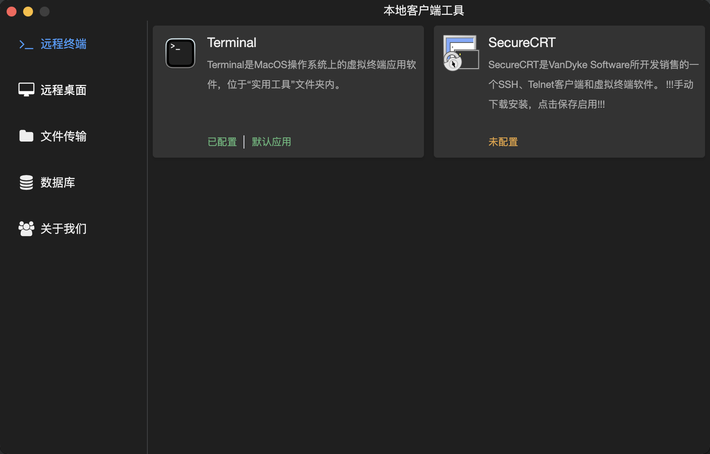

# Jumpserve Clients

JumpServer 客户端，支持本地本地客户端拉起。
## 概览

### Win

### Mac

## 安装

### Mac

下载Mac安装包，安装JumpServer.dmg并将JumpServer.app放入Applications中，双击打开JumpServer.app完成自定义协议。

### Win

下载Win安装包，双击JumpServer.exe 文件（需要等待10几秒钟）。

## 卸载

### Windows

控制面板直接卸载即可。

### Mac

移除JumpServer.app。

## 打包

- [打包方法](https://github.com/jumpserver/apps/blob/master/README_PACK.md)

## 参考

- [浏览器拉起app原理](https://juejin.cn/post/6844903989155217421)
- [Linux浏览器拉起app原理](https://medium.com/swlh/custom-protocol-handling-how-to-8ac41ff651eb)
- [刘正的JumpClient](https://github.com/liuzheng/jumpClient)
