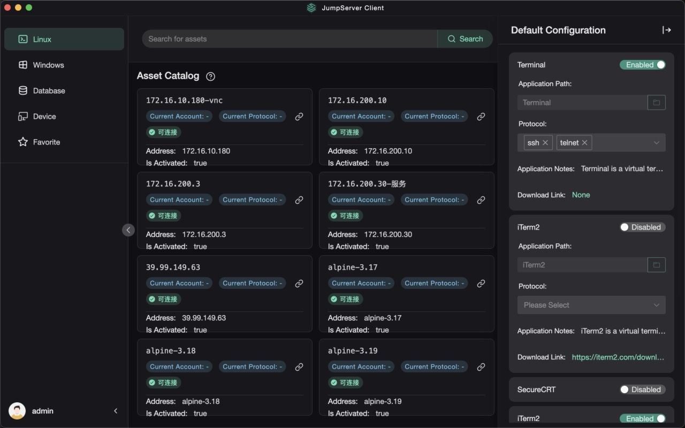

# Jumpserve Client

JumpServer client, supports local client pull up.

English | [中文](README_CN.md)

## Overview



## Install

### Mac

Download the Mac installation package, install JumpServer.dmg and put JumpServer.app into Applications. Double-click to open JumpServer.app to complete the custom protocol.


### Win

Download the Win installation package and double-click the JumpServer installation package file (you need to wait for 10 seconds).


### Linux

Download the Linux installation package, double-click the Deb installation package file, and open the installation package manager to install it. Or install it using the command

```

sudo dpkg -i <package_file>

```


## uninstall

### Windows

Just uninstall the control panel directly.


### Mac

Remove JumpServer.app.


### Linux

Click to open Software Manager to uninstall. Or use the command to uninstall

```

sudo dpkg --purge <package_file>

```


## package

- [packaging scheme](https://github.com/jumpserver/apps/blob/master/README_PACK.md)
