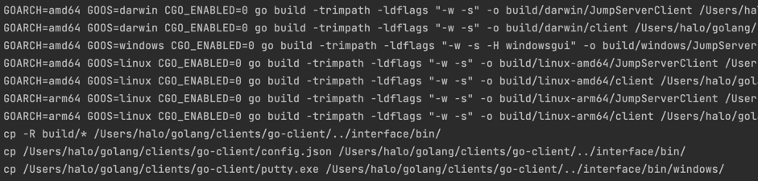

# 打包步骤
## 拉起程序打包
```
cd go-client

make
```


## 用户界面 electron 打包
```
cd interface
```

#### Mac
```
npm run build:mac
```

#### Windows
```
npm run build:mac
```

#### Linux
```
npm run build:mac
```
